# TokensBrücke Design Tokens Pipeline

This document describes the complete workflow for managing design tokens from Figma to CSS using TokensBrücke and Style Dictionary.

## Overview

The design token pipeline consists of:
1. **Figma** - Design source of truth
2. **TokensBrücke** - Figma plugin for token extraction
3. **GitHub Actions** - Automated processing
4. **Style Dictionary** - Token transformation
5. **Generated CSS** - Production-ready stylesheets

```mermaid
graph LR
    A["🎨 Figma Design"] --> B["📦 TokensBrücke Plugin"]
    B --> C["📄 design-tokens.json"]
    C --> D["🔄 GitHub Actions"]
    D --> E["⚙️ Style Dictionary"]
    E --> F["📁 4 CSS Files"]
    F --> G["🌐 Production Apps"]
    
    F --> F1["nyulh-core.css"]
    F --> F2["nyulh-theme.css"] 
    F --> F3["nyulh-components.css"]
    F --> F4["nyulh-device-size.css"]
```



## TokensBrücke Configuration

### Plugin Settings
The TokensBrücke Figma plugin should be configured with the following settings:

```json
{
  "colorMode": "HSLA CSS",
  "includeStyles": {
    "typography": false,
    "grid": false,
    "effect": false
  },
  "includeVariableScopes": false,
  "useDTCGKeys": false,
  "includeValueString": false,
  "includeFigmaMetadata": false
}
```

### GitHub Integration
- **Base Branch**: `develop`
- **Target File**: `design-tokens.json`
- **Auto PR**: Enabled

## Generated CSS Files

The pipeline generates 4 specialized CSS files with the `mt-` prefix:

### 1. `nyulh-core.css`
Core primitive tokens including:
- Color palette (all color scales: Amber, Slate, Blue, etc.)
- Spacing tokens (dimensions from 0px to 100000000px)
- Basic typography values

Example output:
```css
:root {
  --mt-core-color-amber-50: #fffbeb;
  --mt-core-color-slate-950: #020618;
  --mt-core-number-16: 16px;
}
```

### 2. `nyulh-theme.css`
Semantic theme tokens with mode support:
- Surface colors
- Typography colors
- Supports light/dark/high-contrast modes

Example output:
```css
:root {
  --mt-theme-color-surface-dark: #020618;
  --mt-theme-color-surface-white: #cad5e2;
  --mt-theme-color-typography-dark: #ffffff;
}
```

### 3. `nyulh-components.css`
Component-specific design tokens:
- Button colors
- Component-level customizations

Example output:
```css
:root {
  --mt-component-button-color-primary: #ad46ff;
}
```

### 4. `nyulh-device-size.css`
Responsive and breakpoint tokens:
- Device-specific spacing
- Layout tokens
- Typography scaling
- Border radius variations

Example output:
```css
:root {
  --mt-breakpoint-number-spacing-lg: 1px;
  --mt-breakpoint-number-layout-lg: 0px;
}
```

## End-to-End Workflow

### Step 1: Design in Figma
- Create or update design tokens in Figma
- Use consistent naming conventions
- Organize tokens in logical groups (Core, Theme, Component, Breakpoint)

### Step 2: Export with TokensBrücke
1. Open TokensBrücke plugin in Figma
2. Verify settings match the configuration above
3. Click "Push to server" → "GitHub PR"
4. Plugin creates a PR to the `develop` branch with updated `design-tokens.json`

### Step 3: Automated Processing
GitHub Actions automatically:
1. Detects changes to `design-tokens.json` in `develop` branch
2. Installs dependencies with npm
3. Runs Style Dictionary build process
4. Generates 4 CSS files in `build/css/`
5. Commits generated files back to the same PR

### Step 4: Review and Merge
1. Review the generated CSS files in the PR
2. Verify token values and naming
3. Merge PR to deploy tokens

## Token Structure


### Source Format (`design-tokens.json`)
```json
{
  "Core": {
    "Color": {
      "Slate": {
        "950": {
          "type": "color",
          "value": "hsla(229, 85%, 5%, 1)"
        }
      }
    }
  },
  "Theme": {
    "Color": {
      "Surface": {
        "Dark": {
          "type": "color",
          "value": "{Core.Color.Slate.950}",
          "$extensions": {
            "mode": {
              "Light": "{Core.Color.Slate.950}",
              "Dark": "{Core.Color.Slate.50}",
              "High Contrast": "{Core.Color.Slate.50}"
            }
          }
        }
      }
    }
  }
}
```

### Output Format (CSS)
- **Naming**: `--mt-{category}-{path}-{token}`
- **Values**: Resolved references (no `{...}` syntax)
- **Format**: CSS custom properties in `:root`

## Style Dictionary Configuration

The pipeline uses Style Dictionary with the following setup:

```json
{
  "source": ["design-tokens.json"],
  "platforms": {
    "css-core": {
      "transformGroup": "css",
      "prefix": "mt",
      "files": [{
        "destination": "nyulh-core.css",
        "filter": { "attributes": { "category": "Core" }}
      }]
    }
  }
}
```

## GitHub Actions Workflow

### Triggers
- Push to `develop` branch with `design-tokens.json` changes
- Pull requests with `design-tokens.json` changes
- Manual workflow dispatch

### Process
1. **Setup**: Node.js 24, npm install
2. **Build**: `npm run build` (Style Dictionary)
3. **Verify**: Check generated files
4. **Commit**: Auto-commit CSS files to same branch/PR

### Workflow File
Location: `.github/workflows/build-design-tokens.yml`

## Usage in Projects

### Import CSS Files
```html
<!-- Core primitives -->
<link rel="stylesheet" href="path/to/nyulh-core.css">

<!-- Theme tokens -->
<link rel="stylesheet" href="path/to/nyulh-theme.css">

<!-- Component tokens -->
<link rel="stylesheet" href="path/to/nyulh-components.css">

<!-- Responsive tokens -->
<link rel="stylesheet" href="path/to/nyulh-device-size.css">
```

### Use in CSS
```css
.button-primary {
  background-color: var(--mt-component-button-color-primary);
  color: var(--mt-theme-color-typography-dark);
  padding: var(--mt-core-number-16);
}

.surface-dark {
  background-color: var(--mt-theme-color-surface-dark);
}
```

## Development

### Local Build
```bash
npm install
npm run build
```

### Watch Mode
```bash
npm run dev
```

### Clean Build
```bash
npm run clean
npm run build
```

## File Structure

```mermaid
graph TD
    A["📁 Root Directory"] --> B["📄 design-tokens.json"]
    A --> C["📄 config.json"]
    A --> D["📄 package.json"]
    A --> E["📁 .github/workflows/"]
    A --> F["📁 build/css/"]
    
    E --> G["📄 build-design-tokens.yml"]
    
    F --> H["📄 nyulh-core.css"]
    F --> I["📄 nyulh-theme.css"]
    F --> J["📄 nyulh-components.css"]
    F --> K["📄 nyulh-device-size.css"]
    
    B -.->|"Style Dictionary"| F
    C -.->|"Configuration"| F
    G -.->|"GitHub Actions"| F
    
    classDef sourceStyle fill:#e1f5fe
    classDef buildStyle fill:#f3e5f5
    classDef coreStyle fill:#e8f5e8
    classDef themeStyle fill:#fff3e0
    classDef componentStyle fill:#fce4ec
    classDef breakpointStyle fill:#f1f8e9
    
    class B sourceStyle
    class F buildStyle
    class H coreStyle
    class I themeStyle
    class J componentStyle
    class K breakpointStyle
```



```
├── design-tokens.json          # Source tokens from TokensBrücke
├── config.json                 # Style Dictionary configuration
├── package.json                # npm dependencies and scripts
├── .github/workflows/
│   └── build-design-tokens.yml # Automated processing
└── build/css/                  # Generated CSS files
    ├── nyulh-core.css
    ├── nyulh-theme.css
    ├── nyulh-components.css
    └── nyulh-device-size.css
```

## Troubleshooting

### Common Issues

1. **Reference Errors**: Ensure token references use correct syntax `{Core.Color.Slate.950}` without `.$value`
2. **Build Failures**: Check that `design-tokens.json` is valid JSON
3. **Missing Tokens**: Verify TokensBrücke export settings match configuration
4. **CSS Not Generated**: Check GitHub Actions logs for Style Dictionary errors

### Validation
- All tokens must have `type` and `value` properties
- References must point to existing tokens
- HSLA color format: `hsla(hue, saturation%, lightness%, alpha)`

## Maintenance

### Updating Dependencies
```bash
npm update style-dictionary
```

### Modifying Output
1. Edit `config.json` to change file destinations or filters
2. Test locally with `npm run build`
3. Commit changes to update GitHub Actions

## TokensBrücke Installation for Designers

### Prerequisites
- Figma account (Free or Pro)
- Access to Figma files with variables

### Step 1: Install TokensBrücke Plugin

1. **Open Figma** and navigate to any design file
2. **Access Plugins**: Go to `Plugins` → `Browse all plugins` in the main menu
3. **Search for TokensBrücke**: Type "TokensBrücke" in the search bar
4. **Install Plugin**: Click on the TokensBrücke plugin and click "Install"

> **Plugin URL**: https://www.figma.com/community/plugin/1254538877056388290/tokensbrucke

### Step 2: Configure Plugin Settings

When you first run TokensBrücke, configure these essential settings:

```mermaid
graph TD
    A["🔧 TokensBrücke Settings"] --> B["Color Mode: HSLA CSS"]
    A --> C["Include Styles: All False"]
    A --> D["Variable Scopes: False"]
    A --> E["DTCG Keys: False"]
    A --> F["Include Value String: False"]
    A --> G["Figma Metadata: False"]
    
    classDef defaultStyle fill:#f9f9f9
    classDef colorStyle fill:#e8f5e8
    classDef includeStyle fill:#fff3e0
    classDef scopeStyle fill:#fce4ec
    classDef dtcgStyle fill:#f1f8e9
    classDef valueStyle fill:#e1f5fe
    classDef metaStyle fill:#fef3c7
    
    class A defaultStyle
    class B colorStyle
    class C includeStyle
    class D scopeStyle
    class E dtcgStyle
    class F valueStyle
    class G metaStyle
```



#### Required Settings:
- **Color Mode**: `HSLA CSS` (for web compatibility)
- **Include Typography**: `false`
- **Include Grid**: `false` 
- **Include Effect**: `false`
- **Include Variable Scopes**: `false`
- **Use DTCG Keys**: `false` (important for compatibility)
- **Include Value String**: `false`
- **Include Figma Metadata**: `false`

### Step 3: Set Up GitHub Integration

1. **Generate GitHub Token**:
   - Go to GitHub → Settings → Developer settings → Personal access tokens
   - Create token with repository access

2. **Configure TokensBrücke GitHub Settings**:
   - Base Branch: `develop`
   - Target File: `design-tokens.json`
   - Repository: Your design tokens repository
   - Enable Auto PR creation

### Step 4: Export Design Tokens

1. **Run TokensBrücke** in your Figma file
2. **Verify Settings** match the configuration above
3. **Click "Push to server"** → **"GitHub PR"**
4. **Review Generated PR** in GitHub
5. **Wait for GitHub Actions** to process tokens
6. **Merge PR** to deploy new tokens

### Step 5: Verify Token Export

After export, your `design-tokens.json` should contain:

```json
{
  "Core": {
    "Color": { ... },
    "Number": { ... }
  },
  "Theme": {
    "Color": { ... }
  },
  "Component": {
    "Button": { ... }
  },
  "Breakpoint": {
    "Number": { ... }
  }
}
```

### Common Designer Tasks

#### 🎨 Updating Colors
1. Modify color variables in Figma
2. Run TokensBrücke → Export to GitHub
3. Automated CSS generation happens via GitHub Actions

#### 📏 Adding New Tokens
1. Create new variables in Figma with consistent naming
2. Organize in Core/Theme/Component/Breakpoint categories
3. Export and verify in generated CSS files

#### 🔄 Checking Token Changes
- View generated CSS files in `build/css/` folder
- Test changes in demo file: `figma-token-demo.html`
- Monitor GitHub Actions for build status

### Troubleshooting for Designers

#### ❌ Plugin Not Working
- Ensure you have variables (not styles) in your Figma file
- Check plugin settings match the required configuration
- Verify GitHub token has correct permissions

#### ❌ Tokens Not Generating
- Check GitHub Actions tab for build errors
- Ensure `design-tokens.json` is valid JSON
- Verify all token references use correct syntax: `{Core.Color.Slate.950}`

#### ❌ Wrong Token Values
- Double-check Figma variable values
- Ensure HSLA color mode is selected
- Verify token references don't include `.value` suffix

### Designer Workflow Summary

```mermaid
sequenceDiagram
    participant D as Designer
    participant F as Figma
    participant T as TokensBrücke
    participant G as GitHub
    participant A as Actions
    participant C as CSS Files
    
    D->>F: Update design tokens
    D->>T: Run plugin export
    T->>G: Create PR with JSON
    G->>A: Trigger build process
    A->>C: Generate 4 CSS files
    A->>G: Commit CSS to PR
    D->>G: Review & merge PR
    Note over C: Tokens now live in production!
```



This pipeline ensures consistent, automated design token management from Figma to production CSS.